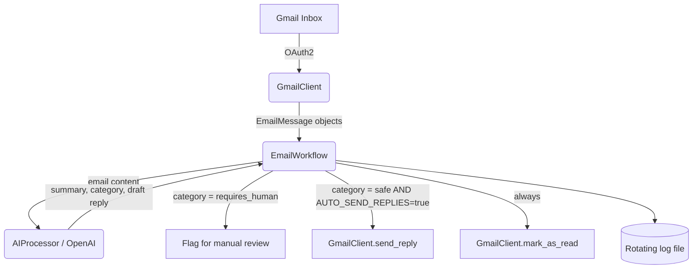

# 📧 AI Email Automation Assistant


An AI-powered assistant that reads your unread Gmail messages, summarizes
them, classifies their urgency, drafts context-aware replies with OpenAI,
and (optionally) sends those replies automatically — with full logging,
error handling, and a human-in-the-loop safety net for anything sensitive.

Built by **Battu Ravindhar** as part of an AI Automation portfolio.

---

## Table of Contents
- [Features](#features)
- [Tech Stack](#tech-stack)
- [Architecture](#architecture)
- [Folder Structure](#folder-structure)
- [Installation](#installation)
- [Google Cloud / Gmail API Setup](#google-cloud--gmail-api-setup)
- [OpenAI API Setup](#openai-api-setup)
- [Environment Variables](#environment-variables)
- [Usage](#usage)
- [Sample Input/Output](#sample-inputoutput)
- [Docker Deployment](#docker-deployment)
- [Production Deployment Guide](#production-deployment-guide)
- [Testing](#testing)
- [Security Best Practices](#security-best-practices)
- [Screenshots](#screenshots)
- [Troubleshooting](#troubleshooting)
- [FAQ](#faq)
- [Future Improvements](#future-improvements)
- [Changelog](#changelog)
- [License](#license)
- [Author](#author)

---

## Features
- 🔐 Secure Gmail OAuth2 authentication (read + send scope only)
- 🧠 AI-powered summarization of every unread email
- 🏷️ Automatic categorization: `urgent`, `informational`, `action_required`, `spam_like`, `requires_human`
- ✍️ AI-drafted, context-aware replies
- 🤖 Optional fully-automatic sending for safe categories
- 🧍 Human-in-the-loop: sensitive/ambiguous emails are never auto-replied
- 📝 Rotating file + console logging
- ♻️ Robust error handling — one bad email never crashes a run
- 🧪 Full unit + integration test suite with mocked external services
- 🐳 Dockerized, with `docker-compose` for one-command startup
- ⚙️ GitHub Actions CI: lint, format-check, test, Docker build

## Tech Stack
| Layer | Technology |
|---|---|
| Language | Python 3.11 |
| AI | OpenAI GPT-4o-mini (Chat Completions API, JSON mode) |
| Email | Gmail API (OAuth2, `google-api-python-client`) |
| Testing | pytest, unittest.mock |
| Lint/Format | flake8, black |
| Containerization | Docker, docker-compose |
| CI/CD | GitHub Actions |

## Architecture



**Why this design:** each box is a separate Python module with a narrow
interface. `EmailWorkflow` is the only place business rules live — it
doesn't know HOW Gmail or OpenAI work internally, only what they return.
This is what lets the test suite fully test the decision logic using fake
stand-ins for Gmail and OpenAI (see `tests/test_workflow.py`), with zero
network calls.

## Folder Structure
```
ai-email-automation-assistant/
├── src/
│   ├── __init__.py
│   ├── config.py          # loads & validates environment variables
│   ├── logger.py          # centralized rotating logger
│   ├── gmail_client.py     # ALL Gmail API code lives here
│   ├── ai_processor.py     # ALL OpenAI API code lives here
│   └── email_workflow.py   # orchestrator / business rules
├── tests/
│   ├── __init__.py
│   ├── test_ai_processor.py
│   └── test_workflow.py
├── .github/workflows/ci.yml
├── main.py                 # entry point
├── requirements.txt
├── .env.example
├── .gitignore
├── Dockerfile
├── docker-compose.yml
├── LICENSE
├── CONTRIBUTING.md
└── README.md
```

## Installation

**Prerequisites:** Python 3.10+, a Google account, an OpenAI account.

```bash
# 1. Clone your repo
git clone https://github.com/<your-username>/ai-email-automation-assistant.git
cd ai-email-automation-assistant

# 2. Create and activate a virtual environment
python -m venv venv
source venv/bin/activate        # Windows: venv\Scripts\activate

# 3. Install dependencies
pip install -r requirements.txt

# 4. Copy the environment template
cp .env.example .env
```

## Google Cloud / Gmail API Setup
1. Go to [console.cloud.google.com](https://console.cloud.google.com) and create a new project.
2. Navigate to **APIs & Services → Library**, search "Gmail API", click **Enable**.
3. Go to **APIs & Services → OAuth consent screen**. Choose **External**, fill in an app name and your email, and add your own Google account as a **Test user** (this avoids Google's app-review process while you're just testing).
4. Go to **APIs & Services → Credentials → Create Credentials → OAuth client ID**. Choose **Desktop app** as the application type.
5. Download the resulting JSON file, rename it `credentials.json`, and place it in the project root.
6. The first time you run `main.py`, a browser tab opens asking you to log in and approve access. After approving, a `token.json` file is created automatically — you won't need to log in again unless you delete it or revoke access.

## OpenAI API Setup
1. Create an account at [platform.openai.com](https://platform.openai.com).
2. Go to **API keys → Create new secret key**. Copy it immediately — OpenAI only shows it once.
3. Add billing details (the API is pay-as-you-go; `gpt-4o-mini` costs fractions of a cent per email).
4. Paste the key into your `.env` file as `OPENAI_API_KEY`.

## Environment Variables
See `.env.example` for the full list. Key ones:

| Variable | Description | Default |
|---|---|---|
| `OPENAI_API_KEY` | Your OpenAI secret key | *required* |
| `OPENAI_MODEL` | Chat model to use | `gpt-4o-mini` |
| `GMAIL_CREDENTIALS_PATH` | Path to OAuth client secret file | `credentials.json` |
| `GMAIL_TOKEN_PATH` | Where the login token is cached | `token.json` |
| `POLL_INTERVAL_SECONDS` | Seconds between inbox checks | `60` |
| `MAX_EMAILS_PER_RUN` | Cap on emails processed per pass | `10` |
| `AUTO_SEND_REPLIES` | `true` to actually send AI replies | `false` |
| `LOG_LEVEL` | `DEBUG`/`INFO`/`WARNING`/`ERROR` | `INFO` |

## Usage

```bash
# Single pass — good for testing or running via cron
python main.py --once

# Continuous polling loop
python main.py
```

On first run with `AUTO_SEND_REPLIES=false` (the safe default), the
assistant will log a summary, category, and draft reply for every unread
email but will NOT send anything — perfect for verifying the AI's
judgment before trusting it to auto-send.

## Sample Input/Output

**Input (unread email):**
> From: client@example.com
> Subject: Question about pricing
> Body: "Hi, could you tell me your enterprise pricing tiers?"

**AI Output (logged):**
```json
{
  "summary": "Client is asking about enterprise pricing tiers.",
  "category": "informational",
  "suggested_reply": "Thanks for reaching out! I'll send over our enterprise pricing sheet shortly — happy to hop on a call if useful."
}
```

## Docker Deployment

```bash
docker compose up --build
```

This builds the image, mounts your `.env`, `credentials.json`, and
`token.json`, and starts the polling loop with logs persisted to
`./logs` on your host machine.

## Production Deployment Guide
For running this continuously in production:
1. **Compute:** a small always-on VM (e.g. AWS EC2 t3.micro, a $5 DigitalOcean droplet, or a Fly.io app) is enough — this workload is I/O-bound, not compute-heavy.
2. **Secrets:** don't ship `.env` in your Docker image. Inject secrets via your platform's secret manager (AWS Secrets Manager, Fly.io secrets, GitHub Actions secrets for CI) and pass them as environment variables at container start.
3. **Process supervision:** use `restart: unless-stopped` (already set in `docker-compose.yml`) or a process manager like `systemd` so the assistant restarts automatically if it crashes.
4. **Monitoring:** ship `logs/email_assistant.log` to a log aggregator (e.g. a simple `cron` + S3 upload, or a hosted service like Better Stack) so you notice failures without SSH-ing in.
5. **Rate limits:** keep `POLL_INTERVAL_SECONDS` reasonable (60s+) to stay well under both Gmail's and OpenAI's rate limits.

## Testing

```bash
pytest tests/ -v                          # run all tests
pytest --cov=src --cov-report=term-missing tests/   # with coverage report
```

- `test_ai_processor.py` — unit tests, mocks the OpenAI client entirely.
- `test_workflow.py` — integration-style tests using fake Gmail/AI
  collaborators to verify business rules (who gets auto-replied to, who
  gets flagged, that one failing email doesn't kill a batch run).

No real API keys or network access are needed to run the test suite.

## Security Best Practices
- `.env`, `credentials.json`, and `token.json` are all git-ignored — never commit real secrets.
- Gmail OAuth scope is limited to `gmail.modify` (read + send + label changes) — **not** full account access or delete permission.
- The Docker image runs as a non-root user.
- All external API calls are wrapped in try/except with logging — failures never leak stack traces containing tokens into logs.
- `requires_human` category exists specifically so the AI never auto-answers on legal, financial, or sensitive matters.

## Screenshots
> Replace these placeholders with real screenshots once you run the project locally.

| Screenshot | Description |
|---|---|
| `docs/screenshot-terminal-run.png` | Terminal output showing a `--once` run: fetched emails, AI categorization, and decisions logged in real time. |
| `docs/screenshot-gmail-thread.png` | A Gmail thread showing an original message and the AI-generated auto-reply sent within it. |
| `docs/screenshot-log-file.png` | Contents of `logs/email_assistant.log` showing rotating log entries. |

## Troubleshooting
| Problem | Cause | Fix |
|---|---|---|
| `FileNotFoundError: credentials.json` | OAuth file missing or misnamed | Re-download from Google Cloud Console, confirm the path matches `GMAIL_CREDENTIALS_PATH` |
| Browser doesn't open for login | Running on a headless server | Run the first authentication on your local machine, then copy the resulting `token.json` to the server |
| `EnvironmentError: OPENAI_API_KEY is not set` | `.env` missing or not loaded | Confirm `.env` exists in the project root and `python-dotenv` is installed |
| `RateLimitError` from OpenAI | Too many requests too fast | Increase `POLL_INTERVAL_SECONDS`, or check your OpenAI usage tier/billing |
| Replies not sending despite `AUTO_SEND_REPLIES=true` | Category was `urgent` or `requires_human` | This is intentional — those categories are never auto-sent by design |

## FAQ
**Q: Will this read/send emails I don't want it to?**
A: It only processes emails currently marked unread in your inbox, and only sends automatically if `AUTO_SEND_REPLIES=true` AND the category is considered safe.

**Q: Can I use a different AI provider?**
A: Yes — since all OpenAI code lives in `ai_processor.py`, you can swap in another provider by rewriting just that file's `analyze_email` method to return the same `EmailAnalysis` shape.

**Q: Does this work with Outlook or other providers?**
A: Not out of the box — you'd write a new client module (e.g. `outlook_client.py`) that returns the same `EmailMessage` objects, and swap it into `main.py`.

**Q: Is my email data sent anywhere besides OpenAI?**
A: No. The only external services contacted are Gmail (to read/send) and OpenAI (to analyze). Email bodies are truncated to 4000 characters before being sent to OpenAI to control cost.

## Future Improvements
- [ ] Web dashboard (FastAPI + React) for reviewing/approving draft replies instead of only logs
- [ ] Support for multiple inboxes / shared team inboxes
- [ ] Attachment-aware summarization
- [ ] Configurable per-sender or per-domain auto-reply rules
- [ ] Slack/Teams notification for `requires_human` emails
- [ ] Swap in a local/open-source LLM option for privacy-sensitive deployments

## Changelog
### v1.0.0 (2026-07-23)
- Initial release: Gmail integration, OpenAI summarization + reply generation, auto-response workflow, full test suite, Docker + CI.

## License
Released under the [MIT License](LICENSE).

## Author
**Battu Ravindhar**
AI Automation Specialist portfolio project.
